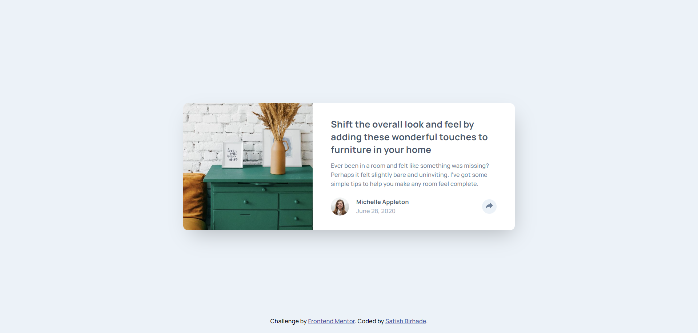
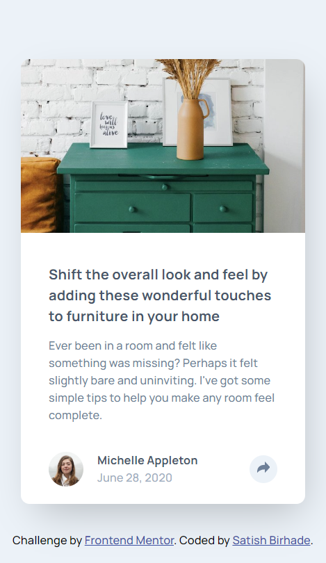

# Frontend Mentor - Article preview component solution

This is a solution to the [Article preview component challenge on Frontend Mentor](https://www.frontendmentor.io/challenges/article-preview-component-dYBN_pYFT). Frontend Mentor challenges help you improve your coding skills by building realistic projects.

## Table of contents

- [Overview](#overview)
  - [The challenge](#the-challenge)
  - [Screenshot](#screenshot)
  - [Links](#links)
- [My process](#my-process)
  - [Built with](#built-with)
  - [What I learned](#what-i-learned)
  - [Continued development](#continued-development)
  - [Useful resources](#useful-resources)
- [Author](#author)

## Overview

### The challenge

Users should be able to:

- View the optimal layout for the component depending on their device's screen size
- See the social media share links when they click the share icon

### Screenshot
#### Desktop View

#### Mobile View

### Links

- Solution URL: [Solution URL here]()
- Live Site URL: [Live site URL here]()

## My process

### Built with

- Semantic HTML5 markup
- CSS custom properties
- Flexbox
- Mobile-first workflow
- Javascript

### Useful resources

- [HTML](https://www.w3schools.com/html/) - The resources on HTML provided by W3Schools were instrumental in helping me understand the structure and semantics of web pages. I particularly appreciated the clear explanations and practical examples, which I will continue to use in future projects.
- [CSS](https://www.w3schools.com/css/) - The comprehensive guide on CSS by W3Schools significantly enhanced my understanding of styling and layout. The detailed tutorials and examples made it easier to grasp complex concepts, and I highly recommend it to anyone looking to improve their CSS skills.

## Author

- Frontend Mentor - [@SatishB15](https://www.frontendmentor.io/profile/SatishB15)
- Twitter - [@BirhadeSatish](https://x.com/BirhadeSatish)
- LinkedIn - [Satish Birhade](www.linkedin.com/in/satish-birhade)